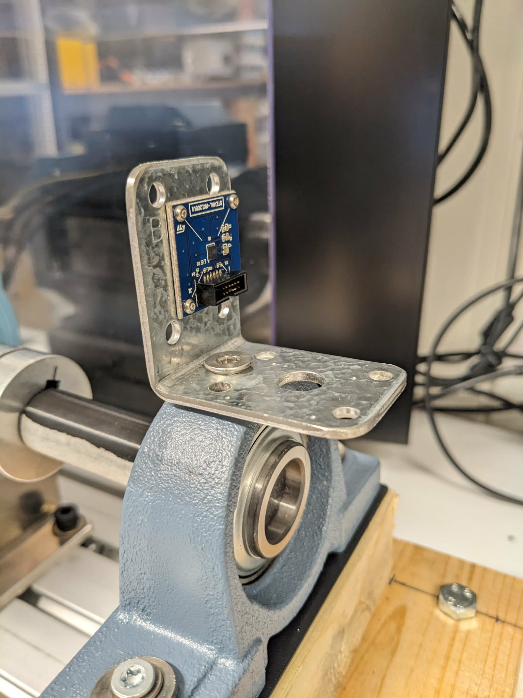
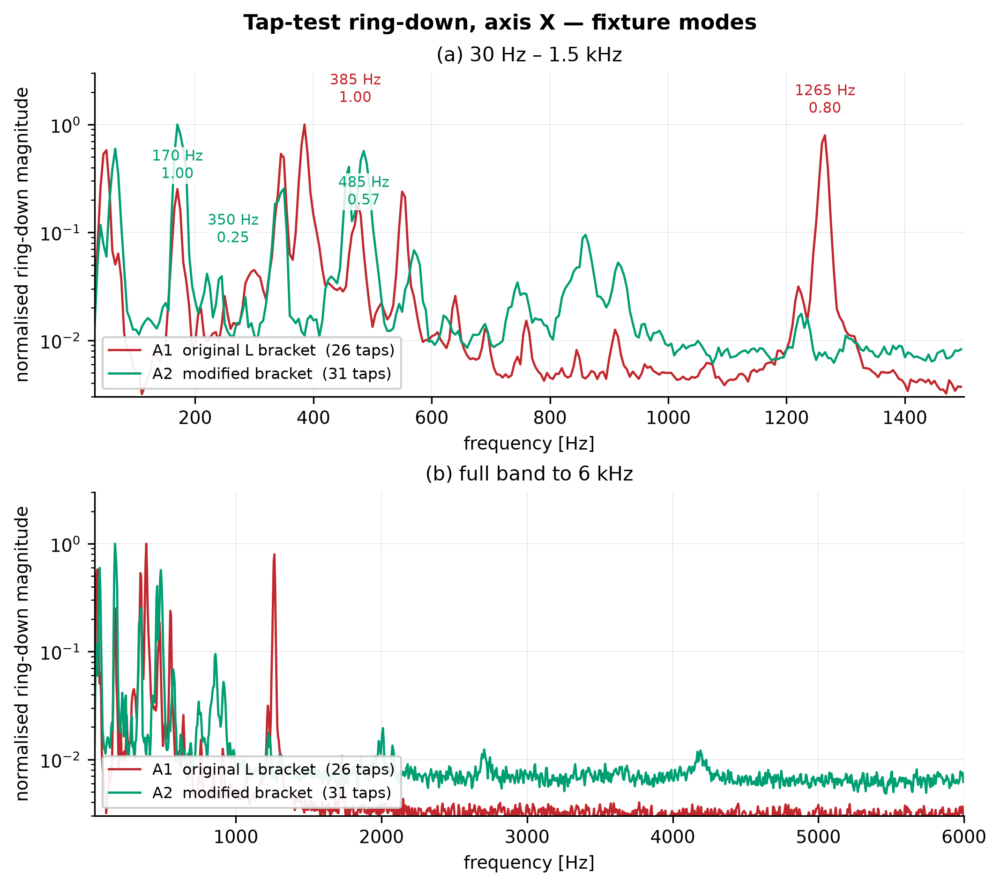
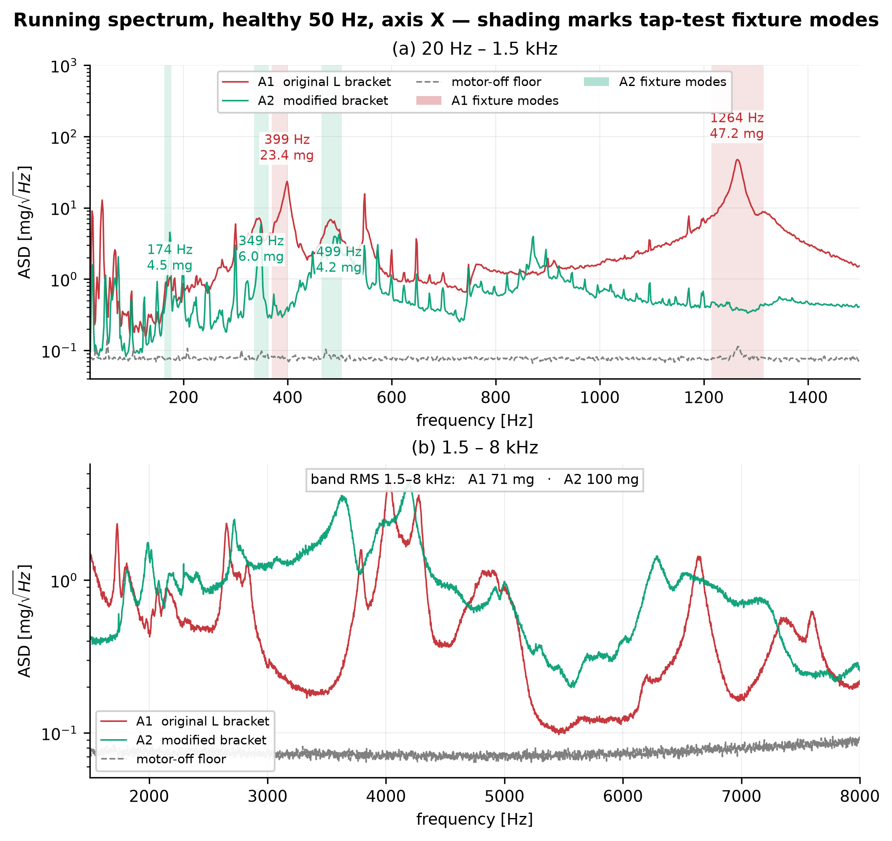

# Weekly Progress

## Week 1 (17aug)
### take-aways from Palina's work
- Her python code reconstructs the simsiam model, but the detector code is missing, so I will implement that myself.
- From her thesis: varying depth produced "little to no variation in accuracy" and she concludes "the smallest viable model is therefore preferred due to fast training and low energy consumption", but never tests how small it can be before it falls apart. This matters because her smallest model is still far too big to embed on general MCU specifications.
- *Architecture 2* uses pooling, so the activation map shrinks with depth (beneficial for size) is the most promising for embedding. It is also the more robust in her own results.

### Model reproduction
- I reproduced her training pipeline:
	- collecting CRWU and windowing the data
	- simsiam model
	- detector (own implementation, but same formula is used)
- Trained over 5 seeds, which she lists as future work. FN is solid at 0 in every seed, FP varies 2-7. So the model is stable but single seed carry rougly ±2 FP of noise.

|                                  | Previous thesis | Reproduction (5 seeds) |
| -------------------------------- | --------------- | ---------------------- |
| False positives (on 656 healthy) | 9               | **5.2 ± 1.8**          |
| False Negatives (on 1424 faulty) | 0               | **0**                  |
## Week 2 (24aug)
### compression
- 95 trained models: 19 configurations (width, depth, scaling) x 5 seeds.

| Channels | Blocks | Parameters | Weights + activations |        AUC | Worst seed AUC |
| -------: | -----: | ---------: | --------------------: | ---------: | -------------: |
|      256 |      5 |    606,296 |                784 kB |     0.9999 |         0.9995 |
|      128 |      5 |    155,864 |                248 kB |     1.0000 |         0.9999 |
|       64 |      5 |     41,240 |                 88 kB |     0.9996 |         0.9991 |
|   **32** |  **3** |  **5,240** |             **29 kB** | **0.9999** |         0.9996 |
|   **16** |  **3** |  **2,024** |             **14 kB** | **0.9996** |         0.9989 |

So a 300x reduction in parameters did not result in a measurable difference in performance. The most deployable model here would be 14kB of weights + activations, which fits most MCU RAM and even the 88Kb of the in-sensor AI core on the IIS3DWB10IS. Memory will thus not be a problem for embedding the model. (at least not on CRWU trained model, own data may need bigger model)

#### Width (channels) is not destructive, depth (blocks) is. (AUC is dispayed)

| Channels |   3 blocks | 5 blocks | 7 blocks |   9 blocks |
| -------: | ---------: | -------: | -------: | ---------: |
|       64 |     0.9992 |   0.9996 |   0.9929 |     0.9508 |
|       32 |     0.9999 |   0.9977 |   0.9623 |     0.8678 |
|       16 | **0.9996** |   0.9973 |   0.9646 | **0.7994** |

To make sure the deeper model were not undertrained, I re-runned 3 vs 9 blocks at 60 epochs instead of 20, and this made the deeper model perform even worse. So the deep models being undertrained can be ruled out.

Conclusions: Both width and depth can be massively reduced with no measurable decrease in performance and shallower models outperform deeper ones. *a reason for this behaviour still needs to be figured out*

## Week 3 (31aug)
### Test rig and sensor mount
Thanks to the Eltorque engineers who helped connecting and configuring the motor driver for the test rig. The rig was mostly ready to be used, but a mount for the sensor still had to be created. Mounting the sensor without filtering or introducing resonance frequencies is not straightforward, since mechanical design is not my background.

The bearing housing has a thread tapped into the top, which I used to bolt on a metal L-bracket with four holes drilled for the sensor PCB. The idea behind the L-bracket is to offer 2 mounting faces: on the vertical face (to use te x/y axis of the sensor), and on the horizontal face (to use the Z plane of the sensor). The intention was to be able to test both, since X/Y axes have lower noise and higher sensitivity then Z. I assumed the axis of most interest would be the X-axis, hence the initial testing is from the sensor mounted on the vertical face.

I later realised this probably matters less than I thought. Bearing vibration is (mostly?) radial, spread across the whole plane perpendicular to the shaft. Mounting it flat/horizontal would then already provide a X or Y axis in the radial plane. This is my reasoning and is not measured (yet?).

### Testing the mount
To acquire good data and stay consistent between measurements/remounts it is very important to test the characteristics of the mount. The task of the mount is to transfer the spectrum of the vibrations from the bearing mount as truly as possible. One thing to look out for is the resonance frequency of the mount itself, as vibrations will excite the mount and make it vibrate at its resonance frequency. If this frequency ovelaps with the spectrum we are measuring, it greatly introduced mount-specific vibrations into the data and thus the trained model. We want to have a clean dataset without too much mount bias.

To know if the resonance frequency is a problem we do a vibration measurement when tapping the mount while the motor is off and when the motor is running normally. If we then do an FFT analysis and see that the frequencies that are present when tapping the mount are also very present when the motor is running in normal condition, it means the mount is expriencing excitement of its resonance frequencies while in normal conditions. With the original mount it was clear that the resonance frequency was very present. 

**These are the major problem of the original mount:**
- The lever effect
- There is no real contact area on the bearing housing. The vibrations may mainly transfer through the bolt.

**To solve this I'm thinking of the following solution:**
- An aluminium block (min. 25x25x5mm) with a countersink to bolt into the bearing housing and 4 small holes for attaching the pcb flat to the aluminium piece. (this aluminium block should have a resonance frequency higher then we can measure with the sensor.) 
- Milling the top of the bearing housing flat to create surface area for the aluminium piece to make contact with

In the meantime, Magnus made a better version of the original mount: rounded edges, a new hole closer to the lever and increased the contact area on the bearing housing. I repeated the same measurements and compared. The motor-off noise floor is identical on both mounts.

**Mount A1** refers to the unmodified bracket
**Mount A2** refers to the modified bracket as pictured below:

- **Tap-test.** The frequencies the fixture (mount) rings at are different: A1 rings at 170, 385 and 1265Hz(!), A2 at 170, 350 and 485Hz. Note that not all the differences in terms of frequencies or amplitude are from the modified L bracket, flattening the bearing housing increased the contact area at the same time, and the two changes were not seperated on the measurements. 

- **Running spectrum,** motor at 50Hz on a healthy bearing, shaft speed is 1493rpm (tachometer). Shading marks the tap-test frequencies, to show the relation. On A1 the resonance dominates (23.4mg @ 399Hz and 47.2mg @ 1264Hz). After modifications those are gone, and A2's own modes are excited at only 4.2-6.0mg, a relative big difference in energy. Above 1.5kHz A2 transfers more energy, which is the improvement we also want.  

- **To conclude:** the modifications  did not eliminate the mount/fixture resonance, but they shifted them and decreaed their magnitude by rougly an order. That is a good improvement. But A2 resonance at 170/350/485Hz still sits inside a important frequency band for diagnosing, so they are still overshadowing what we are trying to measure. So the aluminium block is still worth making. The goal is to push the resonance above the what the sensor can measure.
## Added imbalance (fault)
i added an M3, M6 and M8 nut to the shaft to see if a model trained on the A2 data could flag this inbalance.

Only the M8 nut changed the measured vibration, but the model failed to flag it.

more needs to be written/visualized ...
## Week 4 (7sept)
- Making the aluminium block mount at NTNU metal workshop.
- Below is the result of **mount B1**, with a countersink bore trough the block.
![[mountB1.jpg|379]]

- The same conditions have been logged, analysed and plotted with this mount.
- figures/results need to be added still...
## Week 5 (14sept)
- ST's "turn vibration insight into faster maintenance decisions" webinar were they go over the IIS3DWB10IS sensor (that might be used later)

## Disclaimer
- Figures of the logged data are created from a python script that is created with the help of genAI.